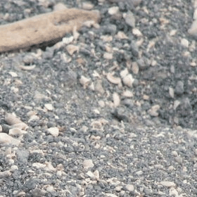
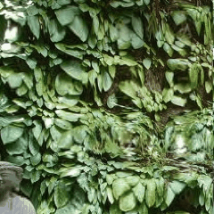
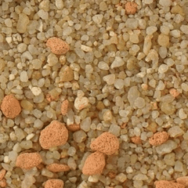
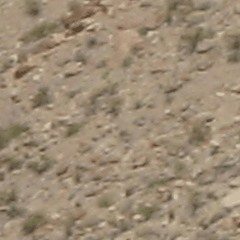
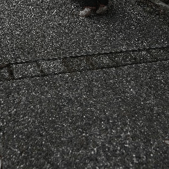
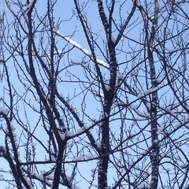
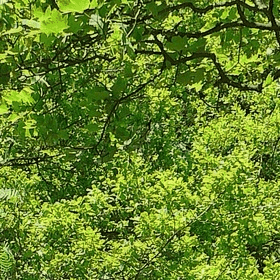
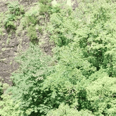
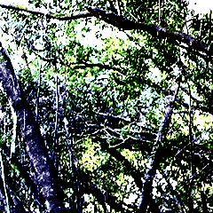

# Code and Pipeline for Generating library for image, maps and PBRs transformations by collecting, suggesting and adapting models from science, math and art

Scripts for generating a library of image and maps transformations and augmentations methods using an agentic AI pipeline that collect suggest and adapt scientific models, methods, and simulations.

The pipeline generates functions for transforming, augmenting, and modifying images using  method, simulations and models and from a wide range of fields, including image processing, camera effects, mathematics, art, physics, biology, chemistry, and other areas of science.

The transformations can be applied to standard RGB images or to maps with any number of channels, such as PBR material maps and hyperspectral images.

Transformations can either:

* Modify a single image, such as blurring, distortion, or noise.
* Gradually transform one image into another, such as crossfading or simulation-based transitions.

The agentic LLM pipeline can:

* Suggest established image transformation methods, such as blurring, crossfading, and noise.
* Or Adapt models and processes from physics, mathematics, biology, chemistry, and art into image transformations.
* Or Propose novel ideas for image manipulation and transformations.
* Generate and validate Python implementations of the proposed transformations.

Together with manual inspection, this code was used to generate the **LOST Library of Image Simulation Transformations and Augmentations**: a collection of approximately 2,000 image transformation and augmentation functions based on methods, models, and simulations from image processing, mathematics, physics, art, and other fields.

### Library of 2K image transformations generated by thie method is available at:   [HuggingFace](https://huggingface.co/datasets/FlyingFrog/Transmute2K-Library-of-Image-Transformations-Simulations-and-Augmentations),   [GIT](https://github.com/sagieppel/-Transmute2K-Library-of-Transformations-Simulations-and-Augmentations), [GIT](https://zenodo.org/records/21420242)
## Examples Image To Image Transformations









 
 ## Examples Image To Image Transformations Single Image Transformations







# Running the Transformation Generation Pipeline

## Main Scripts

* `Create_Transformation_SingleImage.py`
  Creates transformations that gradually modify a single input image or map.

* `Create_Transformation_Image2Image.py`
  Creates transformations that gradually convert a starting image or map into a target image or map.

Both scripts should run with their default settings after an [OpenRouter key]() is configured in `API_KEYS.py`.

# Setup

## Configure the OpenRouter Key

Get an API key and tokens from [OpenRouter]().

Set the key directly in `API_KEYS.py`:

```python
openrouter_api_key = "paste-your-openrouter-key-here"
```

A safer option is to load the key from an environment variable:

```python
import os

openrouter_api_key = os.environ["OPENROUTER_API_KEY"]
```

Then set the environment variable in your shell:

```bash
export OPENROUTER_API_KEY="paste-your-openrouter-key-here"
```

# Generating Image-to-Image Transformations

Use `Create_Transformation_Image2Image.py` to generate transformations between two images or maps, such as transitions from one image, PBR material, or data map to another.

Run the script directly:

```bash
python Create_Transformation_Image2Image.py
```

## Main Parameters (__main__)

`models` = A list of OpenRouter models used to generate transformation ideas. For each generation cycle, one model is selected randomly from this list.

`coding_models` = A list of OpenRouter models used to implement the generated transformation ideas. For each generation cycle, one coding model is selected randomly from this list.

`main_query_dir` = The directory containing prompts that guide transformation generation. For each generation cycle, one prompt group or topic—such as mathematics, art, or physics—is selected randomly and use to suggest and implement transformations methods.

`main_out_dir`  = The output directory in which generated transformations are saved.  

## Output Structure

Generated transformations are organized by topic and transformation name inside `main_out_dir`.

Each transformation subdirectory contains:
* A  `Description.txt` file containing the description of the transformation.
* A `generate.py` file containing the generated transformation code.
* A single sequence of output images or maps showing the transformation over time.
* A single sequence of PBR material transformation. 

Each generated.py code file contains a transform function that perform the transformation
with the following interface:

```python
transform(start_map, end_map, params=None, numsteps=None)
```

### Parameters (__main__)

* `start_map`
  The starting image or map as a NumPy array.

* `end_map`
  The target image or map as a NumPy array.

* `params`
  An optional dictionary containing transformation-specific parameters.

* `numsteps`
  An optional number of steps in the generated transformation sequence.

`start_map` and `end_map` must have identical shapes.

The expected maps/image layout is:

```text
[height, width, channels]
```

## Return Value

The function returns a list of /images with the same shape as `start_map`.

Each item in the list represents one stage of the transformation from `start_map` to `end_map`.

# Generating Single-Image Transformations

Use `Create_Transformation_SingleImage.py` to generate transformations that modify a single image, map, or PBR material according to a rule, model, process, or simulation.

Run the script directly:

```bash
python Create_Transformation_SingleImage.py
```

## Main Parameters (__main__)

The default parameters are configured so that the script can run as-is.

`models` = A list of OpenRouter models used to generate transformation ideas. For each generation cycle, one model is selected randomly from this list.

`coding_models` = A list of OpenRouter models used to implement the generated transformations. For each generation cycle, one coding model is selected randomly from this list.

`main_query_dir` = The directory containing prompts that guide transformation generation.  For each generation cycle, one prompt group or topic—such as mathematics, art, or physics—is selected randomly from this folder.

`main_out_dir` = The output directory in which generated transformations are saved.

## Output Structure

Generated transformations are organized by topic and transformation type inside `main_out_dir`.

Each transformation subdirectory contains:
* A  `Description.txt` file containing the description of the transformation.
* A `generate.py` file containing the generated transformation code.
* A sequence of output images or maps showing the transformation over time.
* A sequence of PBR materials under the transfomation.

Each `generate.py` code file contains a transform function that apply the transformation, with the following interface:

```python
transform(map, params=None, numsteps=None)
```

### Parameters

* `map`
  The input image or map as a NumPy array.

* `params`
  An optional dictionary containing transformation-specific parameters.

* `numsteps`
  The optional number of steps in the generated transformation sequence.

The expected array layout is:

```text
[height, width, channels]
```

## Return Value

The function returns a list of maps with the same shape as the input `map`. Each item in the list represents the map in one stage of the transformation.

# Prompt Folders

These directories contain prompts used to generate transformations based on specific topics or fields:

```text
queries_single_im/<topic>/
queries_im2im/<topic>/
```

Each topic can represent a field such as:

* Image processing
* Mathematics
* Physics
* Biology
* Chemistry
* Art
* Camera effects
* Creative and Novel ideas

# Sample Images and PBR Assets

Validation assets are stored in the following directories:

```text
images/
pbrs/
```

These files are used to test generated transformations and should not be removed.

Expected validation assets include:

```text
images/im1.jpg
images/im2.jpg
pbrs/pbr1/
pbrs/pbr2/
```

# Additional Running Transformations

## `run_im2im.py`

Runs all generated image-to-image transformations in a transformation directory against a folder of images or PBR maps.

`run_im2im.py -> run_transformation_image` Function can be used to run single transformations on two images
`run_im2im.py -> run_transformation_PBR` Function can be used to run single transformations on two  PBR materials 

```bash
python run_im2im.py
```

## `run_single_im_transform.py`

Runs all generated single-image transformations in a transformation directory against a folder of images or PBR maps.

`run_single_im_transform.py -> run_transformation_image` Function can be used to run single transformations on two images
`run_single_im_transform.py -> run_transformation_PBR` Function can be used to run single transformations on two  PBR materials 

